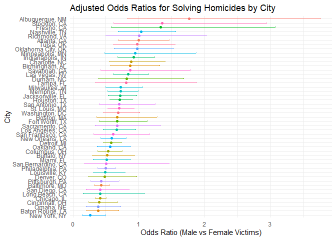

p8105 HW6 jw4693
================
Jianming Wang
2024-11-28

``` r
library(tidyverse)
```

    ## ── Attaching core tidyverse packages ──────────────────────── tidyverse 2.0.0 ──
    ## ✔ dplyr     1.1.4     ✔ readr     2.1.5
    ## ✔ forcats   1.0.0     ✔ stringr   1.5.1
    ## ✔ ggplot2   3.5.1     ✔ tibble    3.2.1
    ## ✔ lubridate 1.9.3     ✔ tidyr     1.3.1
    ## ✔ purrr     1.0.2     
    ## ── Conflicts ────────────────────────────────────────── tidyverse_conflicts() ──
    ## ✖ dplyr::filter() masks stats::filter()
    ## ✖ dplyr::lag()    masks stats::lag()
    ## ℹ Use the conflicted package (<http://conflicted.r-lib.org/>) to force all conflicts to become errors

``` r
library(purrr)
library(ggplot2)
library(modelr)
```

# Problem 2

## Clean the data

Create a city_state variable (e.g. “Baltimore, MD”), and a binary
variable indicating whether the homicide is solved. Omit cities Dallas,
TX; Phoenix, AZ; and Kansas City, MO – these don’t report victim race.
Also omit Tulsa, AL – this is a data entry mistake. For this problem,
limit the analysis those for whom victim_race is white or black. Be sure
that victim_age is numeric.

``` r
homi = read_csv('./homicide-data.csv')
```

    ## Rows: 52179 Columns: 12
    ## ── Column specification ────────────────────────────────────────────────────────
    ## Delimiter: ","
    ## chr (9): uid, victim_last, victim_first, victim_race, victim_age, victim_sex...
    ## dbl (3): reported_date, lat, lon
    ## 
    ## ℹ Use `spec()` to retrieve the full column specification for this data.
    ## ℹ Specify the column types or set `show_col_types = FALSE` to quiet this message.

``` r
homi = homi|>
  mutate(city_state = paste(city, state, sep = ", ")) |>
  filter(
    !city_state %in% c("Dallas, TX", "Phoenix, AZ", "Kansas City, MO", "Tulsa, AL"),
    victim_race %in% c("White", "Black")
  ) |>
  mutate(
    victim_age = as.numeric(victim_age),
    resolved = ifelse(disposition %in% c('Closed without arrest', 'Open/No arrest'), 0, 1)
  ) |>
  drop_na(victim_age)
```

    ## Warning: There was 1 warning in `mutate()`.
    ## ℹ In argument: `victim_age = as.numeric(victim_age)`.
    ## Caused by warning:
    ## ! 强制改变过程中产生了NA

## Baltimore-specific logistic regression

``` r
baltimore_data <- homi %>% filter(city_state == "Baltimore, MD")

baltimore_model <- glm(
  resolved ~ victim_age + victim_sex + victim_race,
  data = baltimore_data,
  family = binomial
)

baltimore_model |>
  broom::tidy() |>
  mutate(
    OR = exp(estimate),
    CI_lower = exp(estimate - 1.96 * std.error),
    CI_upper = exp(estimate + 1.96 * std.error)
  ) |>
  filter(term == "victim_sexMale")
```

    ## # A tibble: 1 × 8
    ##   term           estimate std.error statistic  p.value    OR CI_lower CI_upper
    ##   <chr>             <dbl>     <dbl>     <dbl>    <dbl> <dbl>    <dbl>    <dbl>
    ## 1 victim_sexMale   -0.854     0.138     -6.18 6.26e-10 0.426    0.325    0.558

## City-wide logistic regression

``` r
city_results <- homi |>
  group_by(city_state) |>
  nest() |>
  mutate(
    model = map(data, ~ glm(resolved ~ victim_age + victim_sex + victim_race, data = ., family = binomial)),
    tidy_model = map(model, broom::tidy)
  ) |>
  unnest(tidy_model) |>
  filter(term == "victim_sexMale") |>
  mutate(
    OR = exp(estimate),
    CI_lower = exp(estimate - 1.96 * std.error),
    CI_upper = exp(estimate + 1.96 * std.error)
  ) |>
  select(city_state, OR, CI_lower, CI_upper)

city_results|>
  knitr::kable()
```

| city_state         |        OR |  CI_lower |  CI_upper |
|:-------------------|----------:|----------:|----------:|
| Albuquerque, NM    | 1.7674995 | 0.8306581 | 3.7609388 |
| Atlanta, GA        | 1.0000771 | 0.6836012 | 1.4630669 |
| Baltimore, MD      | 0.4255117 | 0.3245590 | 0.5578655 |
| Baton Rouge, LA    | 0.3814393 | 0.2092532 | 0.6953103 |
| Birmingham, AL     | 0.8700153 | 0.5742951 | 1.3180098 |
| Boston, MA         | 0.6739912 | 0.3560002 | 1.2760222 |
| Buffalo, NY        | 0.5205704 | 0.2897705 | 0.9352008 |
| Charlotte, NC      | 0.8838976 | 0.5569929 | 1.4026659 |
| Chicago, IL        | 0.4100982 | 0.3359897 | 0.5005527 |
| Cincinnati, OH     | 0.3998277 | 0.2360847 | 0.6771390 |
| Columbus, OH       | 0.5324845 | 0.3782581 | 0.7495933 |
| Denver, CO         | 0.4790620 | 0.2364294 | 0.9706934 |
| Detroit, MI        | 0.5823472 | 0.4622017 | 0.7337235 |
| Durham, NC         | 0.8123514 | 0.3920374 | 1.6832957 |
| Fort Worth, TX     | 0.6689803 | 0.3969391 | 1.1274643 |
| Fresno, CA         | 1.3351647 | 0.5804995 | 3.0709150 |
| Houston, TX        | 0.7110264 | 0.5576715 | 0.9065526 |
| Indianapolis, IN   | 0.9187284 | 0.6794344 | 1.2423006 |
| Jacksonville, FL   | 0.7198144 | 0.5365350 | 0.9657017 |
| Las Vegas, NV      | 0.8373078 | 0.6076753 | 1.1537154 |
| Long Beach, CA     | 0.4102163 | 0.1555148 | 1.0820672 |
| Los Angeles, CA    | 0.6618816 | 0.4581299 | 0.9562510 |
| Louisville, KY     | 0.4905546 | 0.3047208 | 0.7897189 |
| Memphis, TN        | 0.7232194 | 0.5291729 | 0.9884224 |
| Miami, FL          | 0.5152379 | 0.3044831 | 0.8718716 |
| Milwaukee, wI      | 0.7271327 | 0.4987091 | 1.0601810 |
| Minneapolis, MN    | 0.9469587 | 0.4782860 | 1.8748838 |
| Nashville, TN      | 1.0342379 | 0.6847143 | 1.5621816 |
| New Orleans, LA    | 0.5849373 | 0.4217648 | 0.8112381 |
| New York, NY       | 0.2623978 | 0.1379459 | 0.4991275 |
| Oakland, CA        | 0.5630819 | 0.3650924 | 0.8684409 |
| Oklahoma City, OK  | 0.9740747 | 0.6240860 | 1.5203378 |
| Omaha, NE          | 0.3824861 | 0.2029670 | 0.7207853 |
| Philadelphia, PA   | 0.4962756 | 0.3776157 | 0.6522225 |
| Pittsburgh, PA     | 0.4307528 | 0.2650983 | 0.6999213 |
| Richmond, VA       | 1.0060520 | 0.4979508 | 2.0326120 |
| San Antonio, TX    | 0.7046200 | 0.3976578 | 1.2485342 |
| Sacramento, CA     | 0.6688418 | 0.3347138 | 1.3365132 |
| Savannah, GA       | 0.8669817 | 0.4222665 | 1.7800544 |
| San Bernardino, CA | 0.5003444 | 0.1712084 | 1.4622204 |
| San Diego, CA      | 0.4130248 | 0.1995220 | 0.8549909 |
| San Francisco, CA  | 0.6075362 | 0.3167902 | 1.1651253 |
| St. Louis, MO      | 0.7031665 | 0.5303670 | 0.9322661 |
| Stockton, CA       | 1.3517273 | 0.6211368 | 2.9416496 |
| Tampa, FL          | 0.8077029 | 0.3477529 | 1.8759988 |
| Tulsa, OK          | 0.9757694 | 0.6135882 | 1.5517343 |
| Washington, DC     | 0.6901713 | 0.4683853 | 1.0169757 |

## Plot the results

``` r
ggplot(city_results, aes(x = reorder(city_state, OR), y = OR, color = city_state)) +
  geom_point() +
  geom_errorbar(aes(ymin = CI_lower, ymax = CI_upper), width = 0.2) +
  coord_flip() +
  labs(
    title = "Adjusted Odds Ratios for Solving Homicides by City",
    x = "City",
    y = "Odds Ratio (Male vs Female Victims)"
  ) +
  theme_minimal()+
  theme(legend.position = 'none')
```

<!-- -->

The plot highlights substantial variability in how gender affects
homicide resolution likelihood across cities. An OR \> 1 indicates that
homicides involving male victims are more likely to be resolved compared
to those involving female victims. Cities with wide CIs, such as
Albuquerque, NM, or Stockton, CA, suggest greater uncertainty in the
estimates, likely due to smaller sample sizes or variability in the
data. If a CI does not cross 1, the effect is considered statistically
significant. Cities with CIs crossing 1 (e.g., Atlanta, GA) indicate no
significant difference in resolution likelihood based on victim gender.

# problem 3

## Data cleaning and conversion

``` r
birth_data <- read_csv("./birthweight.csv")
```

    ## Rows: 4342 Columns: 20
    ## ── Column specification ────────────────────────────────────────────────────────
    ## Delimiter: ","
    ## dbl (20): babysex, bhead, blength, bwt, delwt, fincome, frace, gaweeks, malf...
    ## 
    ## ℹ Use `spec()` to retrieve the full column specification for this data.
    ## ℹ Specify the column types or set `show_col_types = FALSE` to quiet this message.

``` r
str(birth_data)
```

    ## spc_tbl_ [4,342 × 20] (S3: spec_tbl_df/tbl_df/tbl/data.frame)
    ##  $ babysex : num [1:4342] 2 1 2 1 2 1 2 2 1 1 ...
    ##  $ bhead   : num [1:4342] 34 34 36 34 34 33 33 33 36 33 ...
    ##  $ blength : num [1:4342] 51 48 50 52 52 52 46 49 52 50 ...
    ##  $ bwt     : num [1:4342] 3629 3062 3345 3062 3374 ...
    ##  $ delwt   : num [1:4342] 177 156 148 157 156 129 126 140 146 169 ...
    ##  $ fincome : num [1:4342] 35 65 85 55 5 55 96 5 85 75 ...
    ##  $ frace   : num [1:4342] 1 2 1 1 1 1 2 1 1 2 ...
    ##  $ gaweeks : num [1:4342] 39.9 25.9 39.9 40 41.6 ...
    ##  $ malform : num [1:4342] 0 0 0 0 0 0 0 0 0 0 ...
    ##  $ menarche: num [1:4342] 13 14 12 14 13 12 14 12 11 12 ...
    ##  $ mheight : num [1:4342] 63 65 64 64 66 66 72 62 61 64 ...
    ##  $ momage  : num [1:4342] 36 25 29 18 20 23 29 19 13 19 ...
    ##  $ mrace   : num [1:4342] 1 2 1 1 1 1 2 1 1 2 ...
    ##  $ parity  : num [1:4342] 3 0 0 0 0 0 0 0 0 0 ...
    ##  $ pnumlbw : num [1:4342] 0 0 0 0 0 0 0 0 0 0 ...
    ##  $ pnumsga : num [1:4342] 0 0 0 0 0 0 0 0 0 0 ...
    ##  $ ppbmi   : num [1:4342] 26.3 21.3 23.6 21.8 21 ...
    ##  $ ppwt    : num [1:4342] 148 128 137 127 130 115 105 119 105 145 ...
    ##  $ smoken  : num [1:4342] 0 0 1 10 1 0 0 0 0 4 ...
    ##  $ wtgain  : num [1:4342] 29 28 11 30 26 14 21 21 41 24 ...
    ##  - attr(*, "spec")=
    ##   .. cols(
    ##   ..   babysex = col_double(),
    ##   ..   bhead = col_double(),
    ##   ..   blength = col_double(),
    ##   ..   bwt = col_double(),
    ##   ..   delwt = col_double(),
    ##   ..   fincome = col_double(),
    ##   ..   frace = col_double(),
    ##   ..   gaweeks = col_double(),
    ##   ..   malform = col_double(),
    ##   ..   menarche = col_double(),
    ##   ..   mheight = col_double(),
    ##   ..   momage = col_double(),
    ##   ..   mrace = col_double(),
    ##   ..   parity = col_double(),
    ##   ..   pnumlbw = col_double(),
    ##   ..   pnumsga = col_double(),
    ##   ..   ppbmi = col_double(),
    ##   ..   ppwt = col_double(),
    ##   ..   smoken = col_double(),
    ##   ..   wtgain = col_double()
    ##   .. )
    ##  - attr(*, "problems")=<externalptr>

``` r
birth_data <- birth_data |>
  mutate(
    babysex = factor(babysex, levels = c(1, 2), labels = c("Male", "Female")),
    frace = factor(frace),
    mrace = factor(mrace),
    malform = factor(malform)
  ) |>
  drop_na()
summary(birth_data)
```

    ##    babysex         bhead          blength           bwt           delwt      
    ##  Male  :2230   Min.   :21.00   Min.   :20.00   Min.   : 595   Min.   : 86.0  
    ##  Female:2112   1st Qu.:33.00   1st Qu.:48.00   1st Qu.:2807   1st Qu.:131.0  
    ##                Median :34.00   Median :50.00   Median :3132   Median :143.0  
    ##                Mean   :33.65   Mean   :49.75   Mean   :3114   Mean   :145.6  
    ##                3rd Qu.:35.00   3rd Qu.:51.00   3rd Qu.:3459   3rd Qu.:157.0  
    ##                Max.   :41.00   Max.   :63.00   Max.   :4791   Max.   :334.0  
    ##     fincome      frace       gaweeks      malform     menarche    
    ##  Min.   : 0.00   1:2123   Min.   :17.70   0:4327   Min.   : 0.00  
    ##  1st Qu.:25.00   2:1911   1st Qu.:38.30   1:  15   1st Qu.:12.00  
    ##  Median :35.00   3:  46   Median :39.90            Median :12.00  
    ##  Mean   :44.11   4: 248   Mean   :39.43            Mean   :12.51  
    ##  3rd Qu.:65.00   8:  14   3rd Qu.:41.10            3rd Qu.:13.00  
    ##  Max.   :96.00            Max.   :51.30            Max.   :19.00  
    ##     mheight          momage     mrace        parity            pnumlbw 
    ##  Min.   :48.00   Min.   :12.0   1:2147   Min.   :0.000000   Min.   :0  
    ##  1st Qu.:62.00   1st Qu.:18.0   2:1909   1st Qu.:0.000000   1st Qu.:0  
    ##  Median :63.00   Median :20.0   3:  43   Median :0.000000   Median :0  
    ##  Mean   :63.49   Mean   :20.3   4: 243   Mean   :0.002303   Mean   :0  
    ##  3rd Qu.:65.00   3rd Qu.:22.0            3rd Qu.:0.000000   3rd Qu.:0  
    ##  Max.   :77.00   Max.   :44.0            Max.   :6.000000   Max.   :0  
    ##     pnumsga      ppbmi            ppwt           smoken           wtgain      
    ##  Min.   :0   Min.   :13.07   Min.   : 70.0   Min.   : 0.000   Min.   :-46.00  
    ##  1st Qu.:0   1st Qu.:19.53   1st Qu.:110.0   1st Qu.: 0.000   1st Qu.: 15.00  
    ##  Median :0   Median :21.03   Median :120.0   Median : 0.000   Median : 22.00  
    ##  Mean   :0   Mean   :21.57   Mean   :123.5   Mean   : 4.145   Mean   : 22.08  
    ##  3rd Qu.:0   3rd Qu.:22.91   3rd Qu.:134.0   3rd Qu.: 5.000   3rd Qu.: 28.00  
    ##  Max.   :0   Max.   :46.10   Max.   :287.0   Max.   :60.000   Max.   : 89.00

## Proposed Regression Model

``` r
model_proposed <- lm(bwt ~ gaweeks + ppbmi + smoken + wtgain + malform, data = birth_data)

model_proposed|>
  broom::tidy()
```

    ## # A tibble: 6 × 5
    ##   term        estimate std.error statistic   p.value
    ##   <chr>          <dbl>     <dbl>     <dbl>     <dbl>
    ## 1 (Intercept)   112.      96.7     1.16    2.46e-  1
    ## 2 gaweeks        62.1      2.20   28.3     2.52e-161
    ## 3 ppbmi          17.2      2.17    7.93    2.84e- 15
    ## 4 smoken         -6.62     0.925  -7.16    9.72e- 13
    ## 5 wtgain          9.59     0.637  15.1     6.04e- 50
    ## 6 malform1        1.09   117.      0.00936 9.93e-  1

The proposed model hypothesizes that birthweight is influenced by
Gestational Age (gaweeks), Maternal Pre-Pregnancy BMI (ppbmi), Smoking
(smoken), Maternal Weight Gain (wtgain) and Presence of Malformations
(malform).

``` r
birth_data <- birth_data |>
  add_predictions(model_proposed, var = "fitted") |>
  add_residuals(model_proposed, var = "residuals")

ggplot(birth_data, aes(x = fitted, y = residuals)) +
  geom_point(alpha = 0.5, color = '#299') +
  geom_hline(yintercept = 0, linetype = "dashed", color = "#722") +
  labs(
    title = "Residuals vs Fitted Values",
    x = "Fitted Values",
    y = "Residuals"
  ) +
  theme_minimal()
```

<!-- -->

## Comparison of Models

### Different models

``` r
model_length_age <- lm(bwt ~ blength + gaweeks, data = birth_data)
model_length_age|>
  broom::tidy()
```

    ## # A tibble: 3 × 5
    ##   term        estimate std.error statistic  p.value
    ##   <chr>          <dbl>     <dbl>     <dbl>    <dbl>
    ## 1 (Intercept)  -4348.      98.0      -44.4 0       
    ## 2 blength        129.       1.99      64.6 0       
    ## 3 gaweeks         27.0      1.72      15.7 2.36e-54

``` r
model_interactions <- lm(bwt ~ bhead + blength + babysex + bhead* blength + blength*babysex + babysex*bhead + bhead * blength * babysex, data = birth_data)
model_interactions|>
  broom::tidy()
```

    ## # A tibble: 8 × 5
    ##   term                         estimate std.error statistic      p.value
    ##   <chr>                           <dbl>     <dbl>     <dbl>        <dbl>
    ## 1 (Intercept)                 -7177.     1265.       -5.67  0.0000000149
    ## 2 bhead                         182.       38.1       4.78  0.00000184  
    ## 3 blength                       102.       26.2       3.90  0.0000992   
    ## 4 babysexFemale                6375.     1678.        3.80  0.000147    
    ## 5 bhead:blength                  -0.554     0.780    -0.710 0.478       
    ## 6 blength:babysexFemale        -124.       35.1      -3.52  0.000429    
    ## 7 bhead:babysexFemale          -198.       51.1      -3.88  0.000105    
    ## 8 bhead:blength:babysexFemale     3.88      1.06      3.67  0.000245

### Cross validation

``` r
set.seed(12)
prediction_error <- function(model, data) {
  (mean((data$bwt - predict(model, data))^2))^0.5
}
cv_results <- crossv_mc(birth_data, 100) |>
  mutate(
    train = map(train, as_tibble),
    test = map(test, as_tibble))|>
  mutate(
    proposed_error = map2_dbl(train, test, ~ prediction_error(lm(bwt ~ gaweeks + ppbmi + smoken + wtgain + malform, data = .x), .y)),
    length_age_error = map2_dbl(train, test, ~ prediction_error(lm(bwt ~ blength + gaweeks, data = .x), .y)),
    interactions_error = map2_dbl(train, test, ~ prediction_error(lm(bwt ~ bhead + blength + babysex + bhead* blength + blength*babysex + babysex*bhead + bhead * blength * babysex, data = .x), .y))
  )

cv_summary <- cv_results |>
  summarise(
    Proposed_Model = mean(proposed_error),
    Length_Age_Model = mean(length_age_error),
    Interactions_Model = mean(interactions_error)
  )
cv_summary|>
  knitr::kable()
```

| Proposed_Model | Length_Age_Model | Interactions_Model |
|---------------:|-----------------:|-------------------:|
|       451.3393 |         333.5207 |           289.9489 |

``` r
cv_results|>
  pivot_longer(
    cols = proposed_error:interactions_error,
    names_to = 'models',
    values_to = 'squared_root_error'
  )|>
  ggplot(aes(x = models, y = squared_root_error, colour = models))+
  geom_boxplot()+
  theme_minimal()+
  labs(title = 'Bow plot of models squared root errors')
```

<!-- -->

As a result, the model using head circumference, length, sex, and all
interactions (including the three-way interaction) between these
variables is optimal.
